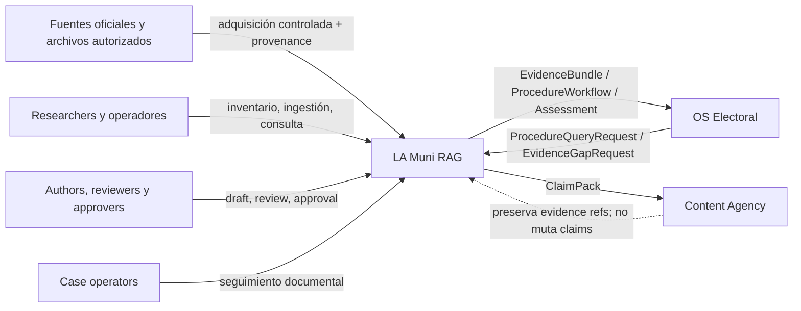

# Contexto del sistema

Estado: contexto objetivo aceptado; integraciones externas no implementadas  
Fecha de corte: 2026-07-18

## Sistema de interés

La Municipal Procedural Intelligence Platform es el sistema de conocimiento documental y procedimental. Registra fuentes y documentos, recupera evidencia, compone procedimientos para revisión y, como estado objetivo, expone artefactos versionados a otros productos.

No es un sistema operativo de campaña ni una agencia de contenido. La clasificación completa está en [Límites del producto](../product/product-boundaries.md).

## Personas y sistemas externos

| Actor o sistema | Necesidad legítima | Límite de autoridad |
|---|---|---|
| Document manager / researcher | Inventariar, adquirir, ingerir, validar y consultar fuentes. | No puede convertir evidencia faltante o comparativa en fuente oficial. |
| Procedure author / reviewer / approver | Estructurar, revisar y aprobar versiones de procedimientos. | Autoría y aprobación deben ser acciones separadas y auditadas; este control aún no está implementado end-to-end. |
| Case operator / viewer | Seguir requisitos y expediente de un caso ligado a una versión. | No modifica la definición del procedimiento. El tracking actual es local-only. |
| Integration client | Consultar evidencia/procedimientos por tenant mediante contrato. | No recibe acceso a tablas internas ni autoridad de mutación. El cliente v1 todavía no existe. |
| OS Electoral | Convertir evidencia cívica en decisiones de campaña. | Es owner de campaña/estrategia; no del corpus o procedimiento. |
| Content Agency | Producir contenido desde briefs y claim packs aprobados. | Es owner de artefactos/publicación; no de claims jurídicos o estrategia electoral. |
| Fuentes oficiales | Publicar documentos o portales de origen. | Una URL no demuestra por sí sola vigencia, alcance o adquisición exitosa. |

## Vista de contexto objetivo



Las flechas hacia productos vecinos describen el contrato objetivo. No implican conectividad actual.

## Topología ejecutable actual

```text
Navegador / CLI
  -> servidor Node HTTP
       -> endpoints MVP /api/*
       -> retrieval y workflow composition en proceso
       -> PostgreSQL rag/agent/audit cuando se configura
  -> archivos locales controlados
       -> source inventory / corpus manifest / artifacts de ingestión

GitHub Pages
  -> superficies estáticas y modo de demostración
  -> no es backend de producción ni system of record
```

Hechos del baseline:

- sólo `/api/procedure-feedback` tiene Bearer token específico; los demás endpoints no forman una frontera autenticada integral;
- no existe namespace `/api/v1`, OpenAPI externo, tenant scope transversal ni RBAC;
- el inventario, la CLI de biblioteca y el pipeline de ingestión son útiles, pero no constituyen un servicio concurrente production-grade;
- el workflow actual es una composición MVP sin lifecycle/version/approval persistente;
- el portfolio/case workspace del navegador usa storage local y no es autoridad institucional;
- OS Electoral y Content Agency no están conectados al runtime.

La evidencia detallada está en la [auditoría de baseline](../../program/baseline-audit.md).

## Contenedores objetivo, sin declaración de implementación

| Contenedor | Responsabilidad | Storage permitido |
|---|---|---|
| Web/API application | Validación, authn/authz, tenant scope, endpoints y errores v1. | Sin estado autoritativo en memoria o navegador. |
| Source/ingestion workers | Adquisición, extracción, chunks, embeddings, retries e idempotency. | Objetos/documentos controlados y records propios de LA Muni RAG. |
| Retrieval/procedure services | Ranking, citas, gaps, compilación y lifecycle. | Sólo repositories propios; no DB vecina. |
| PostgreSQL | Agregados, índices, jobs, approvals, casos y audit propios. | Una base propia por producto; tenant isolation dentro de LA Muni RAG. |
| Integration Gateway | OpenAPI/JSON Schema, idempotency, correlation y contract translation. | Puede conservar receipts/outbox propios; nunca tablas de campaña o content runs. |
| Observability/operations | Logs, metrics, traces, backups, restore e incident response. | Telemetría minimizada sin cuerpos sensibles o secretos. |

Esta separación es un destino de diseño. Workers, Integration Gateway, identity completa y operación production-grade siguen pendientes.

## Trust boundaries

1. **Cliente a API:** toda llamada protegida debe autenticar principal, autorizar acción/recurso y fijar tenant antes de consultar storage.
2. **API a persistence:** repository y DB deben reiterar tenant scope; una condición del cliente no basta.
3. **Fuente externa a corpus:** bytes, MIME, hash, URL, tiempo, autoridad y resultado de extracción deben validarse y auditarse.
4. **Modelo a workflow:** la generación no cruza por sí sola de `draft` a `approved`.
5. **Producto a producto:** sólo API versionada o artefacto schema-validado; no credenciales DB, shared tables ni transacción distribuida.
6. **Build/demo a operación:** Pages, fixtures y sandbox no prueban backend, identidad, publicación o despliegue production-ready.

## Flujos de datos permitidos

### Fuente a evidencia

```text
source record
  -> controlled acquisition
  -> immutable document version + SHA-256
  -> extraction/sections
  -> retrieval candidate
  -> citation/evidence item
```

La autoridad y jurisdicción no se infieren del contenido; provienen de metadata validada y acompañan el resultado.

### Evidencia a procedimiento

```text
question + jurisdiction + case context
  -> evidence bundle
  -> workflow draft with citations/gaps
  -> human review
  -> approved immutable version
```

Las dos últimas transiciones son objetivo pendiente en el runtime actual.

### Intercambio entre productos

```text
consumer request + tenant + idempotency/correlation
  -> Integration Gateway
  -> owner service
  -> immutable artifact + schema version + provenance
```

El consumidor puede tomar decisiones propias usando el artefacto, pero no escribir de vuelta sobre el agregado del productor. Véanse [Contratos entre productos](../integrations/contracts.md), [OS Electoral](../integrations/os-electoral.md) y [Content Agency](../integrations/content-agency.md).

## Dependencias que no son fuente jurídica

Embeddings, modelos, frameworks, cloud, observabilidad y tooling apoyan la ejecución; no determinan autoridad municipal. Context7 puede documentar tecnología, pero no sustituye fuentes jurídicas o municipales.

## Documentos relacionados

- [Contextos delimitados](./bounded-contexts.md)
- [Ownership de datos](./data-ownership.md)
- [Visión de inteligencia procedimental](../product/procedural-intelligence-vision.md)
- [ADR-0001](../adr/0001-product-boundaries-and-data-ownership.md)
